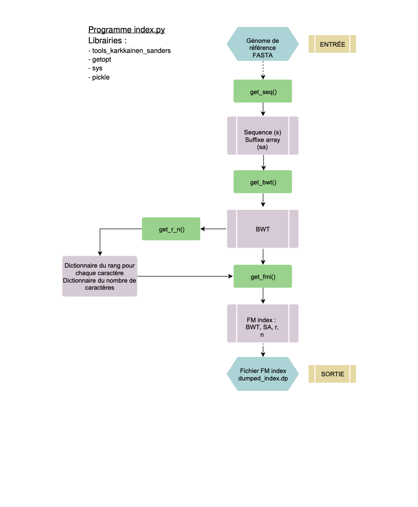
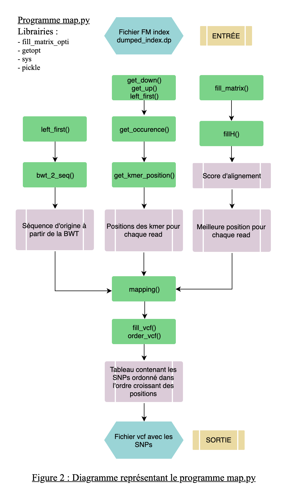

# RAPPORT DÉVELOPPEUR
Gabin Coudray - David Gallien
Master 2 BIS
***
Ce programme a pour but de mettre en place un mappeur sans gap pour la détection de SNPs. Il se distingue en deux fichier.py distincts :
- Le premier permet l'indexation du génome de référence
- Le second permet le mapping des reads sur le génome de référence


## Premier programme : index.py

Le fichier d'indexation nommé index.py a pour but de créer un FM index 
composé de :
- La transformée de Burrows-Wheeler (BWT) du génome de référence
- Le suffix array (SA)
- Le nombre de chaque caractère
- Le rang de chaque caractère

Les 3 derniers éléments de cet FM index permettent de parcourir et requêterla transformée de Burrows Wheeler.


### Fonctionnement du programme 
La fonction *get_fmi(ref_fasta, output_file)* prend en entrée le génome de référence au format fasta ainsi que le nom choisi pour le fichier contenant le FM index créé. En sortie, la fonction retourne un fichier au format binaire contenant le FM index.

Le programme se déroule en deux étapes :  
Dans un premier temps la transformée de Burrows-Wheeler va être déterminée à l'aide du génome de référence puis le rang (r ) et le nombre (n) de chaque caractère vont être identifiés à l'aide de la BWT. A la fin de la première étape nous aurons le Suffix Array et la BWT et à la fin de la deuxième étape nous aurons les deux derniers éléments de l'index r et n.

#### Première étape
##### get_bwt(fasta)
La fonction *get_bwt(fasta: str)* prend en entrée le génome de référence au format fasta et permet d'avoir en sortie la BWT ainsi que le suffix array. 

Elle fonctionne de la manière suivante : 
Dans un premier temps la fonction *get_seq(fasta: str)* traite le fichier du génome de réference. Elle évite la première ligne commençant par ">" puis stockla séquence du génome de référence (s). Enfin, elle créé le suffix array à l'aide la fonction *kark_sort()* qui est importée de *tools_karkkainen_sander.py*. Ensuite, avec la séquence et le suffix array, on peut obtenir la BWT. Enfin, la fonction retourne le suffix array et la transformée de Burrows-Wheeler, qui seront stockés dans le FM index.

#### Deuxième et dernière étape
##### get_r_n(bwt) 
  
La fonction *get_r_n(bwt)* va calculer à partir de la transformée Burrows-Wheeler le rang r et le nombre n pour chaque caractère du génome de référence.
 
Dans un premier temps la fonction initialise un dictionnaire n avec les 4 nucléotides et une liste r pour stocker les rangs. Suite à cela, la BWT va être parcourue et on va implémenter au fur et à mesure notre dictionnaire n et notre list r. On obtiendra donc en sortie les deux derniers élément de notre FM index : n et r. 

Ce programme doit être exécuté avec la commande suivante :

```shell script
python index.py --ref [genome_file.fa] --out [dumped_index.dp]
```
***



***
## Deuxième programme : map.py 
L'objectif de ce progamme est l'alignement des reads sur la séquence de référence tout en choisissant les paramètres de l'alignement : nombre de substitutions maximum, longueur du *k-mer* et minimum d'abondance du SNP.


### mapping(ref, index, reads, k, max_hamming, min_abundance, out_file)

La fonction *mapping()* prend en paramètres le génome de référence (ref), un FM index (index) (voir index.py), la longueur du *k-mer* (k), le nombre maximum de substitutions (max_hamming), l'abondance minimum pour un SNP (min_abundance) et le nom du fichier vcf de sortie (out_file).

Cette fonction va retourner un tableau de SNP au format vcf obtenu grâce à l'alignement des reads sur le génome.

La fonction se décompose en 3 étapes :
- Création d'un dictionnaire contenant les positions d'alignement pour chaque 
k-mer de chaque read
- Création d'un dictionnaire contenant la meilleur position d'alignement pour 
chaque read
- Remplissage de la table des SNPs

#### Etape 1 : Dictionnaire *{read: {kmer: positions}}*
Dans un premier temps le fichier contenant le FM index va être ouvert afin de rendre 
accessible les différents éléments du FM index.


##### get_kmer_position(k, reads, index)
Suite à cela les positions d'alignements des k-mers pour chaque read vont être stockées dans un dictionnaire par la fonction *get_kmer_position(k, reads)* avec 'k' la longueur des k-mers et 'reads' le fichier contenant les reads. Après l'utilisation de cette fonction on obtient donc un dictionnaire au format {Read: {K-mer: position}} pour chaque sens du brin.

Cette fonction permet d'obtenir la ou les positions de chaque kmer sur le brin sens et son reverse complement.

#### Etape 2 : Dictionnaire <i>{read:position}</i> 
Une fois qu'on a toutes les positions possibles pour un kmer, la fonction passe à l'étape de la localisation de la meilleure position d'alignement de chaque read sur le génome de référence pour cela *mapping()* utilise la trame suivante : 
Chaque position associée au read du dictionnaire va être lue pour les brins sens et antisens. Ensuite un score d'alignement est calculé sans gap puis stocké. Enfin, la position avec le score le plus élevé est gardée en prenant en compte le nombre de substitutions maximum. On obtient un dictionnaire final qui contient la meilleure position d'alignement pour chaque read.

#### Etape 3 : Table SNP
Une fois le dictionnaire des meilleures positions d'alignement obtenu, on passe à l'étape de remplissage de la table de SNPs.Pour cela, on a deux fonctions :  
- La première *fill_vcf(mat, dict_final, sequence_initiale)* pour remplir ce tableau - - La seconde *order_vcf(tab_vcf)* pour ordonner les SNPs selon l'ordre croissant des positions.  
Ce tableau est stocké dans un fichier au format vcf de la forme suivante :

```shell script
    #REF: fichier du génome de référence
    #READS: fichier des reads
    #K: longueur du kmer
    #MAX_SUBST: maximum de substitution
    #MIN_ABUNDANCE: minimum d'abondance des SNPs
    POS REF ALT ABUNDANCE
````

Ce programme doit être exécuté avec la commande suivante :

```shell script
python map.py --ref[genome_file.fa] --index[dumped_index.dp] --reads[reads.fa] -k[k_value] --max_hamming[h_value] --min_abundance[m_value] --out snps.vcf
```
***



***


  


